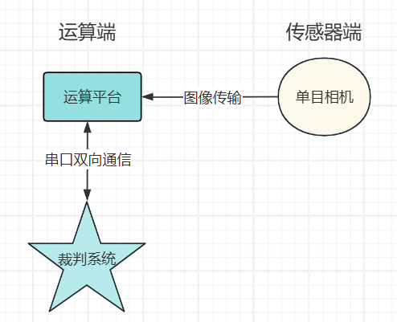
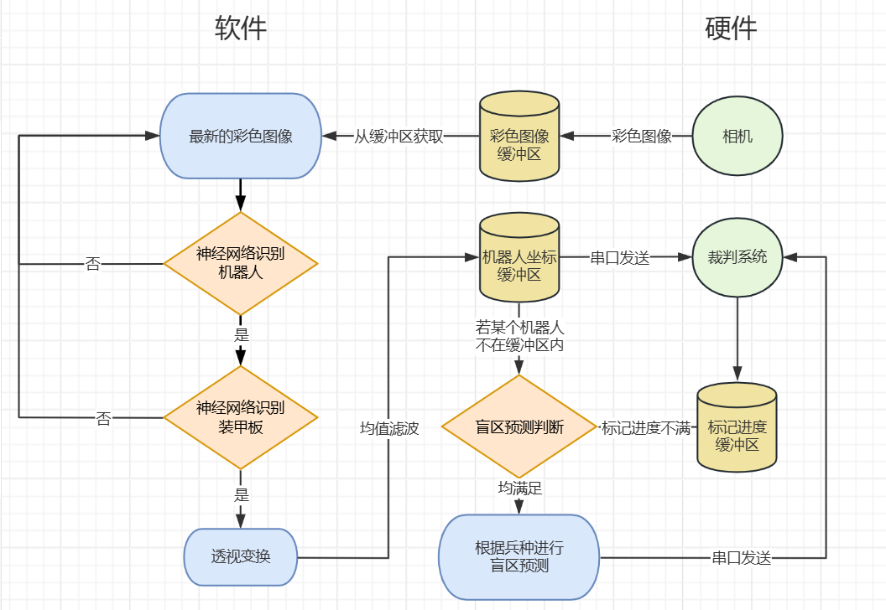

# TUP_Radar_2027

<div align="center">


[](./LICENSE)
[]()
[]()

</div>

##  项目简介

本项目是 **TUP 战队** 为 RoboMaster 竞赛开发的雷达站系统，代码基于 **厦门理工学院（厦理）PFA 战队** 的开源雷达方案进行二次开发，延续了其“纯单目相机”的低成本技术路线。

在原方案基础上，我们主要进行了以下工程化改进与适配：

1.  **技术栈现代化**：将推理框架升级至 **PyTorch 2.11** 并同步更新核心依赖。通过现代化的工具链，充分释放新硬件性能，降低长期维护风险，并为后续的模型量化与部署优化奠定基础。
2.  **多相机兼容**：在保留对厦门理工推荐相机（MV-CS060-10UC-Pro）支持的基础上，新增了对 **MV-CU013-A0UC** 等相机的适配与测试。
3.  **视频测试**：在增加测试视频功能，便于提前测试实际使用的帧率或显存占用，方便后续开发。


##  功能特性

- [x] **目标检测与跟踪**：基于深度学习模型的敌方机器人实时检测与多目标跟踪
- [x] **单目相机定位**：纯视觉方案下的目标空间位置解算
- [x] **串口通信**：通过串口向其他兵种发送决策信息
- [x] **可视化界面**：基于 PyQt5 的上位机调试与监控界面
- [ ] *更多功能持续开发中...*   

## ⚙️ 系统架构


## ⚙️ 软件架构



##  环境依赖与运行

### 硬件测试环境

| 组件 | 型号/规格 |
| :--- | :--- |
| **CPU** | Intel Core i9-14900HX |
| **GPU** | NVIDIA GeForce RTX 5060 Laptop|
| **内存** | 16 GB DDR5 5600 MT/s |
| **相机1** | MV-CS060-10UC-Pro (厦理推荐) |
| **相机2** | MV-CU013-A0UC (已测试) |
| **相机3** | MV-CS020-10UC (已测试) |
| **相机4** | MV-CS016-10UC (已测试) |

### 软件测试环境

| 类别 | 版本/说明 |
| :--- | :--- |
| 操作系统 | Ubuntu 24.04 |
| Python 环境 | Miniconda (Python 3.10) |
| 深度学习框架 | PyTorch 2.11.0 + Torchvision 0.26.0 |
| YOLO 框架 | Ultralytics 8.4.45 |
| TensorRT | 10.16.1 / 8.6.1 |(可选)
| 界面 | PyQt5 |
| Web 调试 | Flask 3.1.3 |

### 依赖列表
建议使用MiniConda管理环境，避免环境冲突(需自己下载)

建立并激活Conda环境
```bash
conda create -n radar python=3.10
conda activate radar
pip install -r requirements.txt
```
完整依赖
```bash
torch==2.11.0
torchvision==0.26.0
numpy==2.2.6
opencv-python-headless==4.13.0.92
pillow==12.1.1
matplotlib==3.10.9
pandas==2.3.3
ultralytics==8.4.45
flask==3.1.3
pyserial==3.5
tqdm==4.67.3
pyyaml==6.0.3
PyQt5
```

### TensorRT加速(可选)
*对于RTX 50 系列等新显卡，必须使用TensorRT 10.8及以上的版本*

- 如需使用TensorRT，请安装tensorrt8.6.1及以上(目前TensorRT加速推理模块支持**TensorRt8.6.1及以上**)

安装好之后
将 .pt 转成 .onnx
执行 YOLOv5 自带的 export 脚本：
```python
python export.py --weights models/armor.pt --include onnx --opset 12 --simplify
python export.py --weights models/car.pt --include onnx --opset 12 --simplify
```
将 .onnx 转成 .engine
Linux：
使用onnx2engine.py
或者使用
```
python export.py --weights models/car.pt --include engine --device 0 --half
python export.py --weights models/armor.pt --include engine --device 0 --half
```
- 如果engine转换失败，可以使用`polygraphy`
```
pip install polygraphy # 这里转换精度为fp16
polygraphy convert models/car.onnx --fp16 --output models/car.engine
polygraphy convert models/armor.onnx --fp16 --output models/armor.engine
```

- 修改config,改models下的.pt模型为.engine,有串口记得确保config下的use_serial为True

#### 运行与验证
启动主程序，日志中应出现 Loading models/xxx.engine for TensorRT inference... 和 [TRT] 相关信息，即表示 TensorRT 已生效。

>    注意：首次加载 engine 会稍慢，后续运行速度明显提升。若出现 [TRT] [W] 警告（如 logger 冲突、默认 stream,更改`/models/common.py`中的tensorrt部分可解决），不影响正常使用，可忽略。

>    注意：注意导出engine文件的精度是否与推理精度匹配。


## 文件结构
```bash
\---TUP_Radar
    |   arrays_test_blue.npy # 蓝方测试变换矩阵
    |   arrays_test_red.npy # 红方测试变换矩阵
    |   calibration.py # 标定部分代码
    |   config.yaml # 配置修改
    |   detect_function.py # 目标检测代码封装
    |   export.py # 模型类型转换代码
    |   hik_camera.py # 海康相机支持代码
    |   information_ui.py # 裁判系统消息显示UI
    |   LICENSE # 开源许可
    |   main.py # 主程序运行代码
    |   make_mask.py # 掩码绘制代码
    |   onnx2engine.py 
    |   qt_display.py # OpenCV GUI实现
    |   README.md
    |
    +---docs # 需求图片文件夹
    |       img.png
    |       map.jpg # 地图图片
    |       map_blue.jpg # 蓝方视角地图
    |       map_mask.jpg # 地图掩码（用于透视变换高度选择）
    |       map_red.jpg # 红方视角地图
    |       map_red_s_mask.jpg
    |       test_image.jpg # 测试鸟瞰图
    |
    +---images-2027 # 需求图片文件夹
    |       map.jpg # 地图
    |       map_blue.jpg
    |       map_mask.jpg # 掩码地图
    |       map_red.jpg
    +---models
    |   |   armor.onnx # 装甲板识别模型
    |   |   armor.pt
    |   |   armor.engine
    |   |   car.onnx # 机器人识别模型
    |   |   car.pt
    |   |   car.engine
    |   |   common.py
    |   |   experimental.py
    |   |   train_log.txt
    |   |   yolo.py
    |   |
    |
    +---MvImport # 海康威视相机驱动代码
    |   |   CameraParams_const.py
    |   |   CameraParams_header.py
    |   |   MvCameraControl_class.py
    |   |   MvErrorDefine_const.py
    |   |   PixelType_header.py
    |   |
    |
    +---RM_serial_py # RM裁判系统通信代码
    |   |   example_receive.py # 接收示例代码
    |   |   example_send.py # 发送示例代码
    |   |   ser_api.py # 裁判系统通信代码函数封装
    |   |
    |
    +---utils # YOLOv5目标检测工具包
    |   |   activations.py
    |   |   augmentations.py
    |   |   autoanchor.py
    |   |   autobatch.py
    |   |   callbacks.py
    |   |   dataloaders.py
    |   |   downloads.py
    |   |   general.py
    |   |   loss.py
    |   |   metrics.py
    |   |   plots.py
    |   |   torch_utils.py
    |   |   triton.py
    |   |   __init__.py
    |   |
    |   |
    |   +---test # 测试区域
    |   |   _.txt
    |   |
    |   |   
    |   +---segment
    |   |   |   augmentations.py
    |   |   |   dataloaders.py
    |   |   |   general.py
    |   |   |   loss.py
    |   |   |   metrics.py
    |   |   |   plots.py
    |   |   |   __init__.py
    |   |   |
    |   |
    |   
```

## 算法原理简述

本项目采用单目相机实现对战场目标的检测与定位，核心流程如下：

    目标检测：使用 YOLOv5模型识别敌方机器人。

    多目标跟踪：对检测到的目标进行 ID 分配与轨迹维持。

    空间定位：基于单目相机模型解算目标相对雷达站的三维坐标。

> 详细算法原理请参考[厦门理工大学（厦理）PFA 战队原开源项目](https://github.com/Y-Tomorrow/PFA_radar-2025.git)。

# 开发日志
- Data:2026.5.28：完善视频测试功能，发布V1.1.0版本
- Data:2026.5.25：完成所有功能测试，发布V1.0.0版本
- Data:2026.5.14：完成TensorRT10.16.1推理加速构建
- Data:2026.5.10：完成代码迁移更新，基础功能通过测试并优化代码逻辑

# Q&A
1. Q：对于`Gain`值未设置成功怎么办？
    - A：调小`Gain`或注释`Gain`使用默认增益；不同相机Gain的阈值会有出入

2. Q：海康相机无法取流（始终打印“等待图像。。。”）
    - A：先查看相机像素格式，再修改`hik_camer.py`，添加新的`Bayerxx`格式分支（可能还会有其他原因，本人还没遇见 O_O）

3. Q： 使用 TensorRT 10.x 加载 `.engine` 文件时报错 `AttributeError: 'ICudaEngine' object has no attribute 'num_bindings'` 怎么办？
    - 这是因为原项目中的 `common.py` 代码基于 TensorRT 7-8 的旧 API 编写，而 TensorRT 10.x 移除了 `num_bindings`、`get_binding_name` 等接口，改用 `num_io_tensors`、`get_tensor_name` 等新 API。
    - 解决办法：
    1. **降级**至TensorRT 8.6.1(与原项目完全兼容)
    2. **升级代码**：修改`models/common.py`中的`DetectMultiBackend`类（389-444）
    (已更新，但未对TensorRT 8.6.1测试)

4. Q： 运行 `calibration.py` 或 `main.py` 时出现 `qt.qpa.plugin: Could not load the Qt platform plugin "xcb"` 或 `QWidget: Must construct a QApplication before a QWidget` 错误，怎么办？
    - A：这是由于 `opencv-python` 与 `PyQt5` 各自捆绑了不同版本的 Qt 库，导致插件冲突；同时 `cv2.imshow` 等 OpenCV GUI 函数与 PyQt5 的事件循环不兼容。
    - **解决办法**：移除标准OpenCV，安装无头版本（避免Qt后端冲突），使用PyQt5重新实现OpenCV的GUI函数。(已解决，可更改`qt_display.py`更改GUI)


# 🤝 致谢
- 本项目核心架构与算法参考了 厦门理工学院（厦理）PFA 战队 的开源雷达项目，在此表示由衷的感谢。

# 联系我们
QQ: 2416411358

E-mail: yangyulun123@126.com